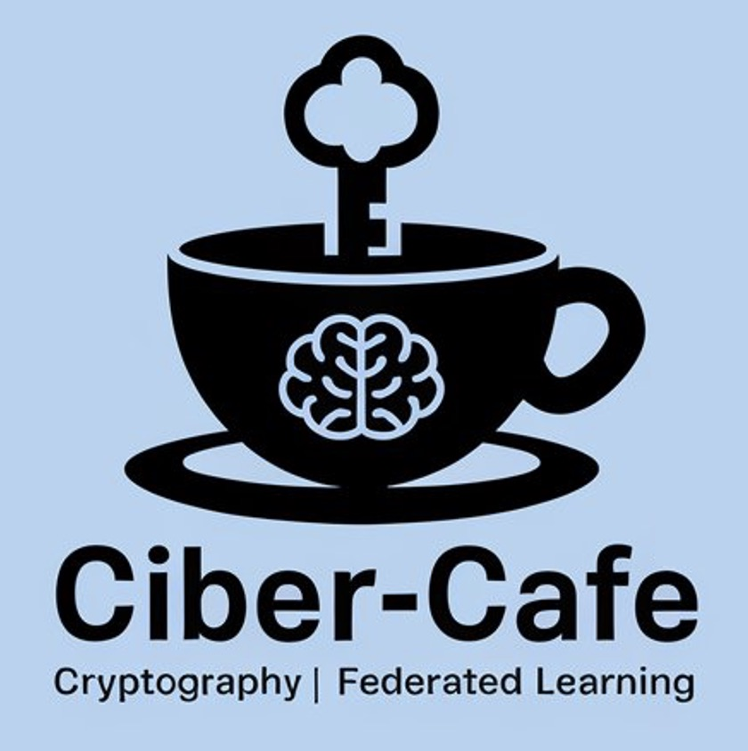

<div align="center">

</div>

# CIBER-CAFE

Research project entitled "CIBERseguridad post-Cuántica para el Aprendizaje FEderado en procesadores de bajo consumo y aceleradores" (Post-Quantum Cybersecurity for FEderated Learning on Low-Power Processors and Accelerators).

## Installation Process

1. Install OpenFHE

Please clone and install the repositories, [openfhe-development](https://github.com/openfheorg/openfhe-development) and [openfhe-python](https://github.com/openfheorg/openfhe-python). The documentation is available in the [OpenFHE documentation](https://openfhe.org/documentation/).

1.1 Install openfhe in your python environment

```
pip install openfhe
```

1.2 Replace the files in the site-packages (e.g. ../lib/python3.10/site-packages/openfhe/) folder with the ones generated from the step 1.1

```
cp <path-to-openfhe-development-build-folder>/lib/lib* /usr/local/lib/python3.10/site-packages/openfhe/lib/
cp <path-to-openfhe-python-build-folder>/build/openfhe.cpython-310-x86_64-linux-gnu.so /usr/local/lib/python3.10/site-packages/openfhe/openfhe.so
```

2. Install requirements

```
pip install -r requirements.txt
pip install -e .
```

### Run the simulation

```
flwr run
```

### Run server

#### Run the Superlink
This command starts the **Superlink**, which acts as the central communication hub for the federated learning system.

````
flower-superlink --insecure
````

#### Run the ServerApp
This starts the server application for federated learning.

````
flwr run . local-deployment --stream
````

#### Run the SuperNode
The supernode facilitates communication between clients and the federated learning server. If it is running locally `--clientappio-api-address 127.0.0.1:9095` and change the port, otherwise remove the line.

````
flower-supernode --insecure --superlink 127.0.0.1:9092 --clientappio-api-address 127.0.0.1:9095 --node-config "partition-id=1 num-partitions=2"
````

#### Run the ClientApp
To add more clients to the **SuperNode**
```
flwr-clientapp --clientappio-api-address 127.0.0.1:<supernode-port> --insecure
```

## Build the docker image

```
docker network create federated-network
docker compose build 
docker compose up -d
```


## Project data

**ID:** C121/23

**FUNDING ENTITY:** Instituto Nacional de Ciberseguridad de España

**PROGRAMME:** Proyectos Estratégicos de Ciberseguridad en España 2022

**PERIOD:** 01/01/2024 - 31/12/2025

**NUMBER OF INVESTIGATORS:** 6

## Contact information

This project belongs to the HPC&A research group from the Universitat Jaume I (Spain).

For more information regarding the project's contribution, please contact:

- Manuel F. Dolz Zaragozá (dolzm@uji.es)

- Sandra Catalán Pallarés (catalans@uji.es)

- Darwin Quezada (quezada@uji.es)

## Acknowledgments

The library has been partially supported by:

- Project PID2023-146569NB-C22 "Inteligencia sostenible en el Borde-UJI" funded by the Spanish Ministry of Science, Innovation and Universities.

- Project C121/23 Convenio "CIBERseguridad post-Cuántica para el Aprendizaje FEderado en procesadores de bajo consumo y aceleradores (CIBER-CAFE)" funded by the Spanish National Cybersecurity Institute (INCIBE).


**Project website:** https://sites.google.com/uji.es/ciber-cafe/home

